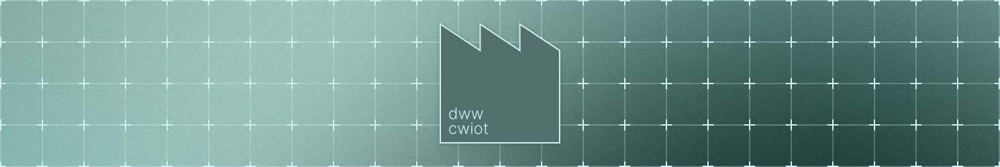
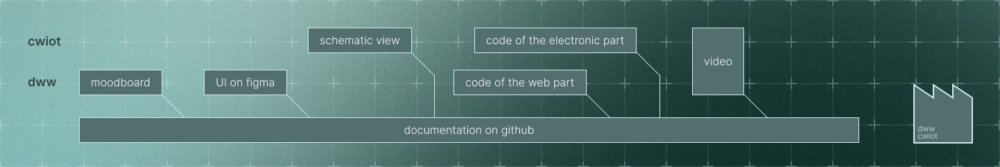
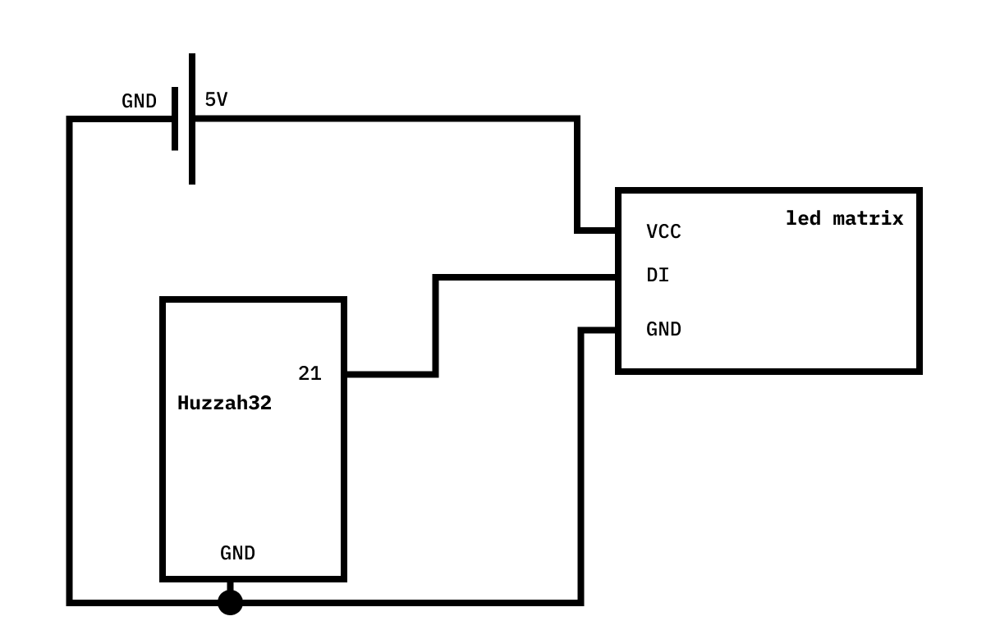
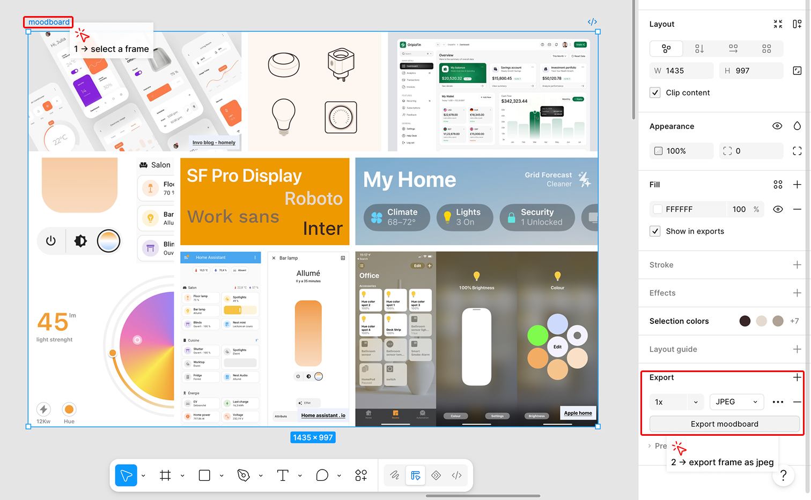
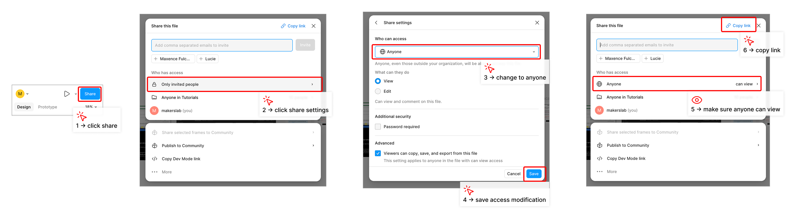
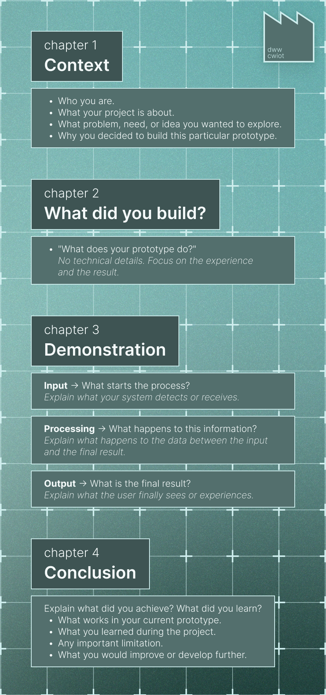
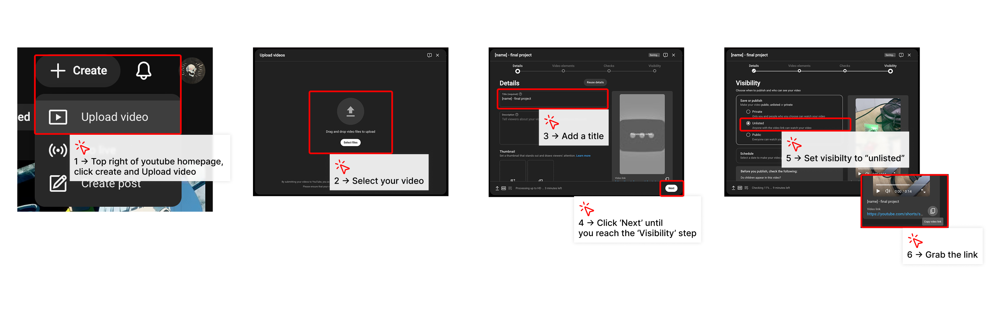
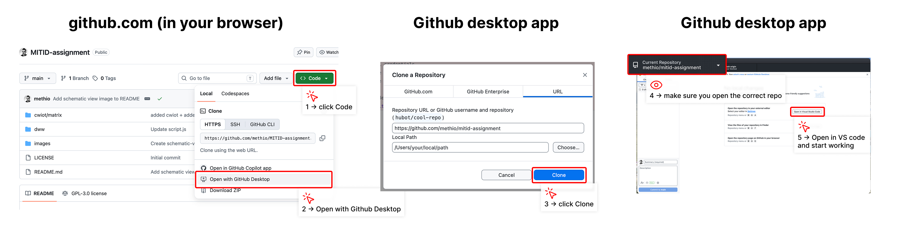

# MITID Assignment

This repository is a template designed to help you complete your project for the dww and cwiot courses. It is intended to document your entire working process. Please take the time to read this page carefully before you begin working.

Here is the table of contents for this page:
- [What you need to produce](#what-you-need-to-produce)
- [Submission demo](#submission-demo)
- [How to clone this repo](#clone-this-repo)
- [How to submit](#how-to-submit)

# What you need to produce

For this assignment, you are required to build a prototype of your project and document your work in a repository. A repository is a storage space used to keep your project code, provide assembly and setup instructions, and demonstrate how your project works. Once your work is complete, you will submit the link to your repository.

| course | required deliverable | where to document it in the repository |
|---|---|---|
| **cwiot** | [Schematic view](#schematic-view) | in the [documentation.md↗](your-name/documentation.md) file|
| **cwiot** | [Code of the electronic part](#code)| in the [arduinoCode.ino↗](your-name/arduinoCode.ino) file |
| **dww** | [Moodboard](#moodboard) | in the [documentation.md↗](your-name/documentation.md) file |
| **dww** | [UI on figma](#user-flow) | in the [documentation.md↗](your-name/documentation.md) file |
| **dww** | [Code of the web part](#user-flow) | in the [web-prototype↗](your-name/web-prototype/) folder |
| **cwiot & dww**| [Video demo](#video)| in the [documentation.md↗](your-name/documentation.md) file |



## cwiot part
### Schematic view

The following example illustrates what is expected for a schematic view. You must create the schematic view yourself, either by hand or using a drawing software. The example below was created using Figma. Automatically generated schematic views created with software such as Tinkercad will not be assessed.

To add your schematic view to your `documentation.md` file, place your image in the [your-name/images↗](your-name/images/) folder. Once the image has been added to the folder, modify the relative path to the image in the `documentation.md` file.

<picture>
    
</picture>

```
<picture>
    
</picture>
```
### Code
Write your code in the Arduino IDE, as you did for the previous exercises. Once your code is functional, copy the complete code from Arduino and paste it into the [arduinoCode.ino↗](your-name/arduinoCode.ino) file.

>[!TIP]
>If your project contains multiple files, such as a `config.h` file, create an additional file in your repository. You can do this by selecting `right click > new file`.


>[!WARNING]
>Make sure to hide your Adafruit API key.\
` #define IO_KEY "aio_SaAN10nJiIl3jGsTI5vMODMjIQ6g" ` should become ` #define IO_KEY "XXX" `

If you have made significant changes to your project, preserve different versions of your project by creating separate folders:

Example folder structure:
```arduino
cwiot
├── project-v1
│   ├── project-v1.ino
│   └── config.h
│
└── project-v2
    ├── project-v2.ino
    └── config.h
```


## dww part

### Moodboard
Add an image of your moodboard to your `documentation.md` file.

>[!TIP]
> Follow the steps below to export your Figma moodboard as a JPEG (or PNG) file and add it to your repository.

<picture>
  
</picture>

>[!TIP]
>To add an image of your moodboard to your `documentation.md` file, follow the instructions provided in the [schematic view↗](#schematic-view) section.

### Figma UI
Share a public link to your Figma project. Follow the steps below to obtain the public link to your project.



>[!TIP]
>To make sure that the project can be accessed, try opening the link in your browser using a private or incognito window. If you can open it, the project should be accessible for assessment. If you cannot access it, the project cannot be assessed.

In the `documentation.md` file, simply replace the URL inside the parentheses: `[Figma UI↗](https\://figma.com/your-design)`


### Code
You must provide the complete source code for your web interface. It is recommended that you work directly in the [web-prototype↗](your-name/web-prototype/) folder. Your HTML, CSS, and JavaScript files should be located in this folder.

## cwiot & dww part

### video
You must present your project through a short demonstration video.

The purpose of the video is not only to demonstrate that your prototype works. You should also explain what you designed, why you designed it, and how the different parts of your project communicate with one another.

Your video should be **1 to 3 minutes long**. There are no specific expectations regarding the length or production quality of the video. Keep it simple, clear, and communicative.

You can use the following structure as a guideline.

<div style="display: grid; grid-template-columns: 1fr 1fr; gap: 20px;">
<div>

**Chapitre 1: Context**

- Who you are.
- What your project is about.
- What problem, need, or idea you wanted to explore.
- Why you decided to build this particular prototype.

**Chapitre 2: What did you build?**

Present your prototype in one or two clear sentences.
Try to answer this question:

- *"What does your prototype do?"*

Avoid explaining the technical details at this stage. Focus on the experience and the result.

Example:

>"Our prototype measures the amount of light in a room and uses this information to dynamically change the visual appearance of a website."

Show the complete prototype while you are explaining it.

**Chapter 3: Demonstration**

Show us that it works. This is the most important part of the video. Start from the point of entry: the first action, event, or piece of information that triggers your system. Then show the complete process from beginning to end. You can structure your explanation using:

**INPUT → PROCESSING → OUTPUT**

1. Input → What starts the process?

Explain what your system detects or receives. In the meantime, show the sensor and, if possible, show the value changing.

>"The electronic prototype uses a light sensor to measure the amount of light in the room."


2. Processing → What happens to this information?

Explain what happens to the data between the input and the final result. Show the relevant part of your prototype, interface, or data.

>"The light level is converted into a numerical value and sent over Wi-Fi to an Adafruit IO feed."


3. Output → What is the final result?

Explain what the user finally sees or experiences. Show the result clearly.

> "The website reads the new value from Adafruit IO and changes its color theme according to the amount of light detected."


Whenever possible, demonstrate the complete chain in real time:
**Sensor → Data → Internet → Website → User experience**

**Chapter 4: Conclusion**

What did you achieve? What did you learn? Finish your video with a short conclusion.You can mention:

- What works in your current prototype.
- What you learned during the project.
- Any important limitation.
- What you would improve or develop further.

For example:

>"This prototype allowed us to connect a physical input to a web interface in real time. If we continued developing the project, we would improve the reliability of the sensor and explore more complex interactions between the physical environment and the website."
</div>
<div>



</div>
</div>


**:movie_camera: Help with creating your video**
The following recommendations can help you create your video.
- Record your video in a quiet environment.
- Use your phone to record the video. (No need for a fancy camera)
- Ask your instructor or a classmate to help you record the video or interact with the prototype.
- You can use a free tool for simple video editing, such as [Canva Video Editor↗](https\://www.canva.com/video-editor/) or [Kapwing↗](https\://www.kapwing.com/studio/editor). (Not mandatory)

Once your video is ready, it is recommended that you upload it to [YouTube↗](https\://www.youtube.com/) by following the steps below. You should then create a link to the video from your [documentation.md↗](your-name/documentation.md) file.



Once you have obtained the link, update your `documentation.md` file by replacing the existing video link.


```
link to video: [documentation video↗](https://www.youtube.com/path/to/your/video).
```


# How to document your work

As you have seen, most of your work should be documented in the [documentation.md↗](/your-name/documentation.md) file. This file serves as the homepage of a GitHub repository.

The `documentation.md` file is written in Markdown, a markup language used by many text editors and documentation tools, such as Notion. You can find a guide to Markdown syntax on GitHub: [Basic writing and formatting syntax↗️](https\://docs.github.com/en/get-started/writing-on-github/getting-started-with-writing-and-formatting-on-github/basic-writing-and-formatting-syntax).

The [documentation.md↗](/your-name/documentation.md) file is a template that you should adapt to your project.

Here are the basics of the syntax:
```
#Header 1     ⬅️ Creates a level 1 heading
##Header 2    ⬅️ Creates a level 2 heading
###Header 3   ⬅️ Creates a level 4 heading

*Mon texte en gras*         ⬅️ makes text bold
_Mon texte en italique_     ⬅️ makes text italic
`mon bout de code`          ⬅️ disaplays text as code

[mon texte](https://mon-lien.com)   ⬅️ creates a link
      ⬅️ adds an image
<picture>                           ⬅️ an alternative way to specify the width and height of your image.
    
</picture>
```

# Submission demo
You can find an example of a completed submission in the [demo↗](/demo/) folder, including the [demo-documentation↗](/demo/demo-documentation.md) page.


# Clone this repo

To begin working on your project, you must first clone this repository.



# How to submit 

If you have any questions, feel free to send me a direct message on Slack or ask me directly at the makers'lab. I will be available to provide assistance.

Make sure to create a final commit and push the latest version of your work to your GitHub repository. I cannot access content that remains only on your local computer.

**The url to your repository must be submitted on Brightspace, under the Designing with Web course only!**