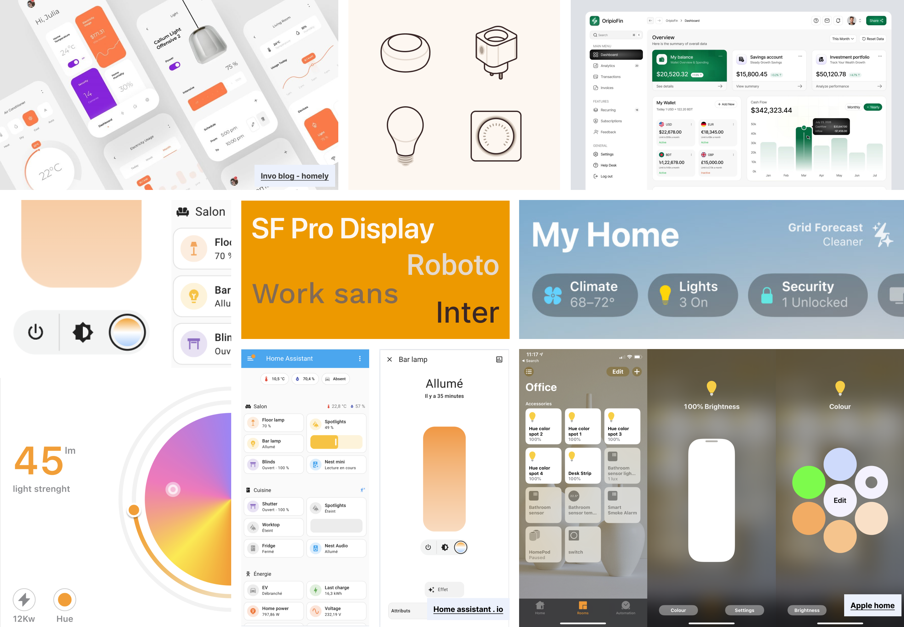
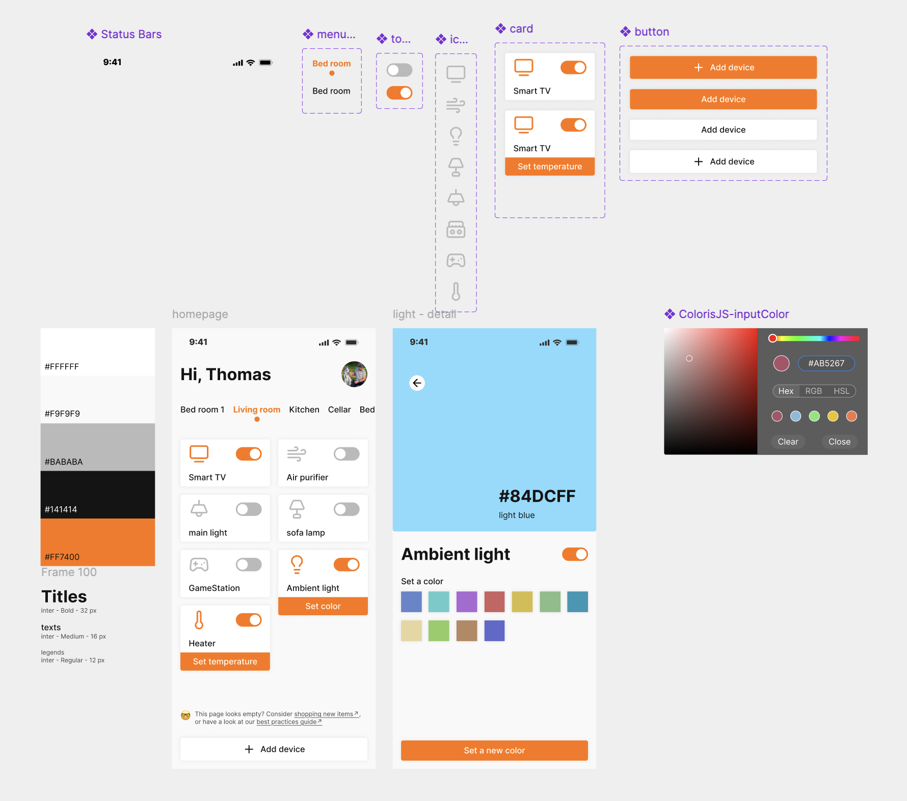

# MITID Assignment

Ce repo est un template à dupliquer pour vous aider à réaliser votre projet pour les cours dww et cwiot. Il sert à documenter l'ensemble de votre processus de travail, prennez le temps de bien lire cette page avant de commencer à travailler. 

Voici la table des matières de cette page 
- [What you need to produce](#what-you-need-to-produce)
- [Submission demo](#demo)
- [How to clone this repo]()
- [How to submit]()

## What you need to produce

Pour ce devoir, vous devez réaliser le prototype de votre projet et le documenter dans un repo. Pour rappel, un repo est un espace de stockage pour garder le code de votre projet, conserver des explications de montage et montrer votre projet en fonctionnement. Une fois le travail complété, vous soumettrez le lien vers votre repo. 

| cours | ce qui est attendu | où le documenter dans le repo | 
|---|---|---|
| **cwiot** | [Code of the electronic part](#code)| dans le fichier [arduinoCode.ino↗](your-name/arduinoCode.ino) |
| **cwiot** | [Schematic view](#schematic-view) | dans le fichier [documentation.md↗](your-name/documentation.md) |
| **dww** | [Moodboard](#moodboard) | dans le fichier [documentation.md↗](your-name/documentation.md) |
| **dww** | [UI on figma](#user-flow) | dans le fichier [documentation.md↗](your-name/documentation.md) |
| **dww** | [Code of the web part](#user-flow) | dans le dossier [web-prototype↗](your-name/web-prototype/) |


### cwiot part

#### **Code**
Écrivez le code dans l'éditeur arduino, comme pour les exercices précédents. Une fois que le code est fonctionnel, copiez l'ensemble de votre code depuis arduino. Collez le ensuite dans le fichier [arduinoCode.ino↗](your-name/arduinoCode.ino). 

>[!TIP]
>Si vous avez plusieurs fichiers, comme un fichier `config.h`, créez un deuxième fichier dans votre repo. Il vous suffit de faire `right click > new file`. 

>[!WARNING]
>Pensez bien à cacher votre clé API adafruit.\
`#define IO_KEY "aio_SaAN10nJiIl3jGsTI5vMODMjIQ6g" ` devient `#define IO_KEY "XXX"`

Si vous avez fait des changements importants dans votre projet, conserver les versions de votre projet en créant des dossiers:

Example folder structure:
```arduino
cwiot
├── project-v1
│   ├── project-v1.ino
│   └── config.h
│
└── project-v2
    ├── project-v2.ino
    └── config.h
```

#### **Schematic view**

Pour rappel, voici ce qui est attendu pour une schematic view. Vous devez la dessiner vous-même, à la main ou à l'aide d'un logiciel de dessin. L'exemple ci-dessous a été réalisé avec figma. Les schematics view générées "automatiquement" via un logiciel, comme tinkerCAD, ne seront pas évaluées. 

<!-- this a way to add an image an modify its displayed size-->
<picture>
    
</picture>

Pour ajouter votre schematic view dans votre `documentation.md`, il faut ajouter votre image dans le dossier [your-name/images↗](your-name/images/). Une fois l'image présente dans le dossier, il vous suffira de modifier le chemin relatif vers votre image dans le fichier `documentation.md`.

```
<picture>
    
</picture>
```

### For DWW

#### **Moodboard**
Add an image of your moodboard in your `documentation.md` file.

>[!TIP]
> Suivez les étapes suivantes pour exporter votre moodboard figma au format jpeg (ou png) et l'ajouter à votre repo. 

<picture>
  
</picture>

>[!TIP]
>Pour ajouter une image de votre moodboard dans votre `documentation.md`, suivez les informations de la section [schematic view↗](#schematic-view).

#### **Figma UI**
Partagez un lien public vers votre projet figma. Suivez les étapes ci-dessous pour récupérer le lien public vers votre projet.


>[!TIP]
>Pour vous assurer que je pourrais ouvrir le lien, essayez de l'ouvrir dans votre navigateur, dans un onglet de navigation privée. S'il s'ouvre, j'y aurais accès. Si je n'y ai pas accès, je ne pourrais pas évaluer cette partie du travail.

Dans la `documentation.md`, il vous suffit de changer l'url dans la parenthèse: `[figma UI↗](https://figma.com/your-design)`

#### **Code**
Vous devez partager l'intégralité du code de votre interface web. Je vous conseille de travailler directement dans le dossier [web-prototype↗](your-name/web-prototype/). Vos fichiers html, css et javascript doivent se trouver dans ce dossier. 


--- 

## Submission demo

### CWIOT

#### Schematic view 


#### Video
Youtube video of the prototype lerping between colors

<a href="http://www.youtube.com/watch?feature=player_embedded&v=Rb1v3GvMv4M
" target="_blank"></a>

### DWW

#### Moodboard



#### User flow 
[See the user flow in figma↗](https://www.figma.com/design/vJZb0jIlyBSZZtqP1hdXyH/Assignment-designing-with-web-demo?node-id=0-1&t=i6oES4CvV3SZhfUw-1)



## How to clone this repo

### Comment documenter mon travail

Votre travail doit être documenté dans un fichier `README.md`. C'est le fichier qui sert de page d'accueil dans un repo github. Ce fichier `README.md` est écrit en markdown. C'est un langage utilisé dans de nombreux éditeurs de textes, comme notion par exemple. Vous trouverez un guide de la syntaxe sur github: [Basic writing and formatting syntax↗️](https://docs.github.com/en/get-started/writing-on-github/getting-started-with-writing-and-formatting-on-github/basic-writing-and-formatting-syntax). 

Voici les bases de la syntaxe:
```
#Header 1     ⬅️ vous donnera un titre de niveau 1
##Header 2    ⬅️ vous donnera un titre de niveau 2
###Header 3   ⬅️ vous donnera un titre de niveau 3

*Mon texte en gras*         ⬅️ pour mettre un texte en gras
_Mon texte en italique_     ⬅️ pour mettre un texte en italique
`mon bout de code`          ⬅️ pour mettre un texte dans un code

[mon texte](https://mon-lien.fr)    ⬅️ pour créer un lien
      ⬅️ pour ajouter une image
```

## How to submit 

Suivez ces étapes pour bien soumettre votre travail. Il n'y a rien de sorcier, mais prennez le temps de bien lire toute cette section, puis faites le sur votre ordinateur. Si vous avez un doute, n'hésitez pas à me faire un mp sur slack ou me demander directement au makers'lab. Je me rendrais disponible pour vous aider. 

Un dernier commit. Assurez-vous de bien push la dernière version de votre travail dans votre repo sur github. Je n'ai pas accès au contenu que vous gardez localement. 

GIF copier le lien du repo et le poser dans la boite de soumission sur BS. 

**The link to your repository must be submitted on Brightspace, under the Designing with Web course only!**